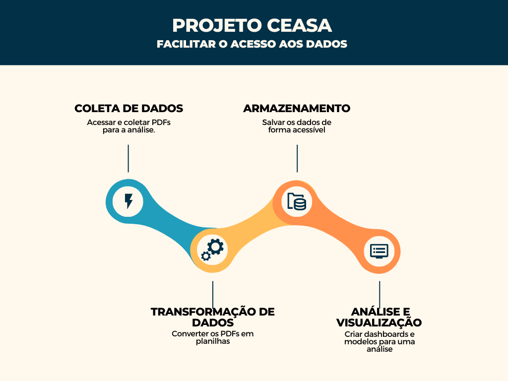

# Projeto CEASA

## Objetivo

Facilitar o acesso aos dados do Centrais de Abastecimento do Estado do Rio de Janeiro S.A (CEASA-RJ) por meio de um processo automatizado de coleta, transformação e análise de dados.

## Motivação

A necessidade de disponibilizar informações do CEASA-RJ de maneira mais acessível, transformando dados presentes em PDFs em formatos utilizáveis para análise e insights mais rápidos.

## Etapas do Projeto

### 1. Coleta de Dados

- Acessar o site do CEASA-RJ
- Utilizar BeautifulSoup para extrair links e informações dos PDFs.
- Coletar PDFs de cotação.

#### Postagem 1:

    🚀 **Automatização da Coleta de Dados no Projeto CEASA-RJ: Detalhando o Primeiro Passo!**

    Olá pessoal! Estou empolgado para compartilhar o andamento do #ProjetoCEASARJ, que visa aprimorar o acesso às informações sobre os preços dos alimentos na Central de Abastecimento do Rio de Janeiro! 🌐📊

    **1ª Etapa: Coleta de Dados 📥**
    Nessa fase inicial de coleta, utilizei a técnica de web scraping para extrair URLs contendo documentos PDF do site da CEASA-RJ. Com a ajuda do BeautifulSoup, naveguei pelo DOM do HTML, identificando links e extraindo os arquivos desejados, que foram armazenados em uma lista. 🕵️‍♂️🔍

    A identificação de novos PDFs foi seguida pelo download local para processamento posterior. A partir dos nomes dos arquivos, como 'Boletim%2017%2011%202023.pdf' para 'Boletim_17_11_2023.pdf', extrai os nomes e as datas dos documentos, registrando tudo em um arquivo Parquet para manter a organização na coleta de dados. 🗂️📆

    **Principais Ferramentas:**
    - Python (requests, BeautifulSoup)
    - Parquet para persistência das informações

    **Objetivo:**-
    Proporcionar acesso às cotações da CEASA-RJ, automatizando os processos de coleta, transformação e análise para extrair insights de maneira eficiente. 🔄💡

    Fiquem atentos para mais atualizações conforme avançamos na jornada do Projeto CEASA-RJ! Conectem-se ou comentem se tiverem dúvidas ou insights. Vamos impulsionar a inovação por meio dos dados! 🌐🔗

    repositório do projeto: https://github.com/revalani/Projeto-CEASA

    #ColetaDeDados #Automatização #ProjetoCEASARJ #CiênciaDeDados #WebScraping #Python #PostLinkedIn

### 2. Transformação de Dados

- Converter os PDFs em planilhas, tornando os dados mais acessíveis e manipuláveis.
- Utilizar Pandas para a manipulação eficiente desses dados.

### 3. Armazenamento

- Salvar os dados de forma acessível, como em planilhas no Google Sheets.

### 4. Análise e Visualização

- Criar dashboards e modelos para uma análise mais avançada dos dados.

## Pendente

- Implementação de embiente virtual (env) para replicação do ambiente.

## Tecnologias Utilizadas

- Python
- BeautifulSoup
- Pandas
- Pdfplumber

## Como Contribuir

Sinta-se à vontade para fazer sugestões, reportar problemas ou contribuir para o projeto. O seu feedback é valioso!

---

**Observação:** Este documento está em constante evolução. Fique à vontade para acompanhar as atualizações e contribuir para o crescimento do Projeto CEASA! 🚀